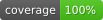

# NgxUswdsIcons



This project uses Angular 21 and Node 24.

## Prerequisites

Use the Node version pinned in `.nvmrc` before installing dependencies or running project commands.

```bash
nvm use
npm ci
```

## Development server

Run `npm start` for a dev server. Navigate to `http://localhost:4200/`. The app will automatically reload if you change any of the source files.

## Code scaffolding

Run `ng generate component component-name` to generate a new component. You can also use `ng generate directive|pipe|service|class|guard|interface|enum|module`.

## Build

Run `npm run build` to build the demo application. The build artifacts will be stored in the `dist/` directory.

Run `npm run build-prod` to build the publishable `ngx-uswds-icons` library package.

## Linting

This project uses [ESLint 9](https://eslint.org/) with flat config (`eslint.config.mjs`), replacing the legacy TSLint/codelyzer setup.

```bash
npm run lint
```

The config file is `eslint.config.mjs`. Generated files in `projects/icons/src/lib/uswds-icons/` and `scripts/` are excluded from linting. Angular templates are checked with both the recommended and accessibility rule sets from `@angular-eslint/eslint-plugin-template`.

### Accessibility scope

Template accessibility linting is the accepted WCAG 2.1 AA gate for this repository. This package is a small icon library with no independent color, contrast, focus-order, or rendered ARIA-state surface; those runtime characteristics depend on the consuming application and must be tested there. The demo's Playwright suite remains a smoke test and is not presented as a complete runtime WCAG audit. No repository-specific runtime accessibility follow-up is currently warranted.

## Formatting

This project uses [Prettier](https://prettier.io/) for code style enforcement. Config is in `.prettierrc`.

```bash
# Format all files in place
npm run format

# Check formatting without modifying files (also runs in CI)
npm run format:check
```

Generated files in `projects/icons/src/lib/uswds-icons/` and `scripts/` are excluded via `.prettierignore`.

## Running unit tests

Run `npm test` to execute the unit tests via [Vitest](https://vitest.dev/).

## Running end-to-end tests

Run `npm run e2e` to execute the Playwright smoke test against the demo application in Chromium. On a fresh local checkout, run `npx playwright install chromium` once before the first e2e run.

The current e2e scope is intentionally narrow: Playwright starts the Angular demo app, loads the root page, fails on browser console errors, and verifies that expected demo content and at least one rendered SVG icon are present. This provides upgrade confidence without introducing a broad, high-maintenance browser test suite.

## Contributing

Pull requests are welcome. Please follow these guidelines:

- Branch names follow the convention `gh-<issue-number>-<short-slug>` (e.g. `gh-38-add-pull-request-template`).
- Every PR should reference a GitHub issue — include `Closes #<number>` in the PR description.
- All PRs use the repository's pull request template (`.github/pull_request_template.md`), which GitHub loads automatically when you open a PR.
- Ensure `npm run lint`, `npm run format:check`, `npm run build-prod`, and `npm run test` all pass before requesting review.

## Further help

To get more help on the Angular CLI use `ng help` or go check out the [Angular CLI Overview and Command Reference](https://angular.io/cli) page.
